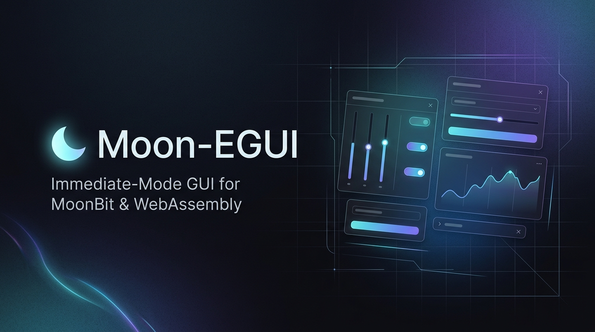

<div align="center">

# moon-egui

**面向 MoonBit 与 WebAssembly 的轻量级即时模式图形界面库**

<p>
  <a href="README.md">English</a> · 简体中文
</p>

<p>
  <a href="https://ling71671.github.io/moon-egui/"></a>
  <a href="https://ling71671.github.io/moon-egui/benchmark.html"></a>
  <a href="https://github.com/LING71671/moon-egui/actions"></a>
  <a href="LICENSE"></a>
  <a href="https://www.moonbitlang.com/"></a>
  
  <a href="https://moonbitlang.github.io/Hackathon2026/"></a>
</p>

<br />



</div>

---

## 概述

`moon-egui` 是面向 [MoonBit](https://www.moonbitlang.com/) 编程语言的轻量级**即时模式图形界面库（Immediate-Mode GUI）**，面向 WebAssembly 与 HTML5 Canvas 2D 等图形交互场景设计。

设计灵感源自 Rust 社区的 `egui` 与 C++ `Dear ImGui`。`moon-egui` 采用即时模式范式：**代码即界面，界面即状态**。通过逐帧声明式构建，提供直观的 UI 开发体验、轻量级的运行时占用与平稳的渲染表现。

### 为什么选择 moon-egui？

在 WebAssembly 与 Canvas 绘图场景下构建交互界面时，开发者通常面临以下挑战：

- **传统 Canvas 逻辑的维护负担**：手写按钮坐标计算、命中碰撞检测与图层排序，代码量大且极易产生状态不同步缺陷。
- **DOM / 虚拟 DOM 的性能抖动**：在 60 FPS 高频画布应用中引入保留模式框架，跨语言/跨边界调用与垃圾回收（GC）容易引发偶发掉帧。
- **C/C++ 绑定的工具链门槛**：基于 FFI 的外部 GUI 包装依赖复杂的本地编译链，产物体积较大，且无法享受纯粹的包管理体验。

### 核心特性

- **即时模式心智**：逐帧声明界面，无需维护生命周期回调与双向同步，交互判定就地完成（例如 `if @widgets.button(ctx, "保存").clicked { ... }`）。
- **零 FFI 原生依赖**：100% 纯 MoonBit 编写，内核解耦宿主环境，零外部运行时依赖，一行 `moon add` 即装即用。
- **微秒级帧管线**：内置视口空间裁剪与图元合并，单帧内核开销低至 0.1ms，在百万节点画布下稳定跑满 60 FPS。
- **开箱即用套件**：内置层级窗口（支持拖拽置顶与视口约束）、标签栏、支持真实键盘输入的文本框、防穿透下拉框与工具提示。

---

## 安装

```bash
# 安装最新稳定版本
moon add LING71671/moon-egui

# 或指定锁定版本
moon add LING71671/moon-egui@0.3.1
```

安装后在 `moon.pkg` 中按需引入分层包：只做自绘 HUD 时引入 `src/core`（纯即时模式运行时），需要内置控件时再叠加 `src/widgets`（标准控件）与 `src/composite`（高级组件）。

```json
{
  "import": [
    "LING71671/moon-egui/src/core",
    "LING71671/moon-egui/src/widgets",
    "LING71671/moon-egui/src/composite",
    "LING71671/moon-egui/src/draw",
    "LING71671/moon-egui/src/math",
    "LING71671/moon-egui/src/color"
  ]
}
```

---

## 在线演示 (Live Demos)

您可以通过现代浏览器直接体验 `moon-egui` 的交互功能与图形渲染效果：

- **[在线交互主页 (Interactive Demo)](https://ling71671.github.io/moon-egui/)**
  包含即时模式基础控件展示、菜单栏、浮动窗口与轻量画板交互预览。
- **[画板与多尺度矩阵测试 (Canvas & Multi-Scale Benchmark)](https://ling71671.github.io/moon-egui/benchmark.html)**
  包含 128² 至 1024²（16,384 ~ 1,048,576 节点）多尺度像素晶格阵列、CAD 双轴标尺、视口平移/缩放漫游、以及像素晶格分界线渲染。

---

## 快速代码示例

```moonbit
fn update_ui(ctx : @core.UIContext, state : AppState) {
  // 1. 全局系统菜单栏（src/composite）
  @composite.menu_bar(ctx, fn(top) {
    @composite.menu(top, "文件", fn(menu) {
      if @composite.menu_item(menu, "新建项目").clicked { state.new_project() }
      if @composite.menu_item(menu, "保存配置").clicked { state.save() }
    })
    @composite.menu(top, "视图", fn(menu) {
      if @composite.menu_item(menu, "切换主题").clicked { state.toggle_theme() }
    })
  })

  // 2. 浮动可拖拽视窗（src/widgets）
  @widgets.window(ctx, "控制台 & 属性监视", @math.Vec2::new(50.0, 50.0), @math.Vec2::new(300.0, 420.0), fn(win) {
    let _ = win.label("欢迎使用 moon-egui")

    if @widgets.button(win, "触发测试").clicked {
      state.counter += 1
    }

    // Blender 风格数值拖拽调节
    let (gravity, _) = @widgets.drag_value(win, "重力参数", state.gravity, speed=0.1, min=0.0, max=20.0)
    state.gravity = gravity
    let (collision, _) = @widgets.checkbox(win, "开启物理碰撞", state.collision_enabled)
    state.collision_enabled = collision

    // 折叠数据面板
    @widgets.collapsing_header(win, "render_monitor", "实时渲染监控", false, fn(panel) {
      let (_, _) = @composite.sparkline(panel, "fps", state.fps_history)
      @widgets.progress_bar(panel, state.progress)
    })
  })
}
```

---

## 架构体系

`moon-egui` 将 UI 求值与宿主渲染完全解耦，采用三层严谨的单向数据流管道：

```
[ 输入事件流 (Input Events) ]
  • 鼠标指针绝对坐标与按键状态
  • 键盘按键与修饰键
  • 鼠标滚轮滑动增量 (Delta)
         │
         ▼
[ moon-egui 纯算内核 ]
  • 输入状态机 (Hover, Active, Focused)
  • 线性游标排版与 AABB 空间命中判定
  • 矩形 Scissor 裁剪栈
  • 即时模式控件逻辑求值
         │
         ▼
[ 绘制指令序列 (DrawCmd Stream) ]
  • DrawCmd::Rect(x, y, w, h, color, radius)
  • DrawCmd::Text(x, y, text, size, color)
  • DrawCmd::Line(x1, y1, x2, y2, color, width)
  • DrawCmd::Clip(x, y, w, h)
         │
         ▼
[ 可插拔渲染后端 (Render Backends) ]
  • HTML5 Canvas 2D (默认 Wasm 桥接)
  • WebGL / WebGPU (规划演进)
  • 原生窗口引擎 (Raylib / SDL / Minifb)
```

---

## 核心特性矩阵

### 已交付可用特性 (Available Now)
- **底层图形与绘制内核 (Core Draw Engine)**：纯 MoonBit 实现的 `Vec2`, `Rect`, `Color`, `DrawCmd` 平台无关指令流，支持矩形、线段、圆、文本与嵌套矩形裁剪栈（Scissor Clipping）。
- **交互状态机与多向排版 (Layout & Space Allocation)**：`UIContext` 维护 `hot_id` / `active_id` 状态机与布局作用域栈，支持单向垂直流、水平行内排版流（`horizontal`），`allocate_space()` 自动分配几何尺寸并完成鼠标交互命中判定。
- **核心交互控件套件 (35 Available Widgets)**：
  - **基础输入与编辑**：`button`（支持快捷键、主次样式与尺寸）、`text_edit`（单行文本输入与隐藏式 IME 桥接）、`code_editor`（多行代码编辑器，支持行号、语法着色、选区高亮、光标滚动、全选与快捷键）、`label` / `label_colored`。
  - **选择与调节**：`checkbox`（精密复选框）、`toggle`（双稳态胶囊开关）、`radio`（单选框）、`slider` / `slider_int`（连续/步进数值条）、`drag_value`（数字微调器）、`knob`（270° 圆弧行程旋钮）、`fader` / `fader_int`（垂直通道推子调节器）、`combo_box`（自适应碰撞翻转下拉框）、`color_button` / `color_picker`（HSV 调色取色盘）。
  - **反馈与通知**：`progress_bar`（平滑进度条）、`badge`（状态徽标与点标）、`toast`（悬浮通知弹窗与遮罩阻断）、`tooltip`（视口防溢出气泡提示）、`spinner`（旋转加载指示器）。
  - **数据可视化与图表**：`sparkline`（实时微型走势图）、`plot`（即时模式工程图表，支持折线、散点、面积多系列混排、双轴刻度与准心浮窗）、`bar_chart`（自适应宽度柱状统计图）。
  - **高级导航与交互**：`menu_bar`（桌面级菜单栏）、`context_menu`（递归级联多级右键菜单）、`command_palette`（全局快捷命令检索面板）、`tree_view`（资产层次树）、`segmented_control`（分段选择器）、`breadcrumb`（导航面包屑）。
  - **排版微调与流式布局**：`separator`（水平发丝分割线）、`spacer`（弹性留白）、`horizontal_wrapped`（自动折行流式布局）。
- **视窗与高级容器系统 (Windows & Containers)**：
  - **全局顶层菜单栏**：`menu_bar`, `menu`, `menu_item`, `menu_separator`，具备前台图层投影隔离、桌面级 Hover-to-Switch 随动流转与外部点击安全闭合；
  - **自由浮动视窗**：`window` 支持标题栏拖拽位移、动态 Z-Index 置顶管理、内容局部坐标系与 Scissor 视口裁剪；
  - **高级容器**：`splitter`（双向可拖拽分栏器）、`table`（高性能数据表格与列宽拖拽）、`collapsing_header`（树形折叠分组）、`scroll_area`（滚轮与滑块交互视口滚动）、`tab_bar`（标签导航）、`dialog`（模态确认对话框与焦点陷阱）。
- **无头纯算与高覆盖测试**：核心图元与组件逻辑完全脱离浏览器，内置 211 项自动化无头白盒与黑盒测试（100% 通过）。
- **Canvas 2D 宿主驱动器**：轻量 JavaScript 桥接层与 60 FPS 渲染管线，结合 O(1) 视口边界裁剪与自适应 LOD 架构。

### 规划与演进中特性 (Planned / In Roadmap)
- **硬件加速渲染后端**：WebGL / WebGPU 批量几何图元渲染器与自定义着色器流水线。
- **跨平台原生桌面桥接**：Raylib / SDL3 跨平台窗口环境驱动器适配。
- **复杂流图与节点编辑**：节点流连线编辑器 (`NodeEditor`)。

---

## 开发路线图（2026 年 9 月 9 日 — 9 月 25 日）

### 第一阶段：核心架构与基础套件（9月9日 – 9月11日）[已全面交付]
- [x] **里程碑 1：工程骨架与基础数学图元**：`Vec2`, `Rect`, `Color`, `InputState`, `DrawCmd`, `DrawList`。
- [x] **里程碑 2：输入状态机与基础排版**：AABB 命中判定、横纵排版流、`Button`, `Label`, `Checkbox`, `Slider`, `SliderInt`。
- [x] **里程碑 3：高级视窗与容器系统**：`Window` 拖拽与动态 Z-Index 置顶、全局顶层菜单栏（`MenuBar`）、视口滚动（`ScrollArea`）、折叠分组（`CollapsingHeader`）。
- [x] **里程碑 4：Canvas 2D 驱动与百万节点画板**：60 FPS HTML5 Canvas 2D 宿主、自适应 LOD、GitHub Pages 自动化静态上线。

### 第二阶段：专业工程能力深度演进（9月12日 – 9月25日）
- [x] **里程碑 5：专业桌面交互与输入系统**（已全面交付）：全局命令面板 (`CommandPalette` / `⌘K`)、右键上下文菜单 (`ContextMenu`)、代码编辑控件 (`CodeEditor`)、资产树控件 (`TreeView`)、环形旋钮 (`Knob`)、垂直推子 (`Fader`)、全自宿主 Pure Canvas Studio。
- [x] **里程碑 6：工作台排版体系与高弹性控件**（已交付）：可拖拽弹性分栏器 (`Splitter`)、虚拟化数据表格 (`Table`)、模态对话框 (`Dialog`)、通知提示 (`Toast`)、流式自动折行 (`horizontal_wrapped`)、多主题系统 (`Theme`)。
- [x] **里程碑 9：工程化验证、基准评测与正式发布**（已交付）：167 项自动化无头单元测试（100% 通过）、Wasm-GC 编译支持、正式发布 `v0.2.0`。
- [ ] **里程碑 7：数据密集型组件与高级可视化**（演进中）：节点流连线编辑器 (`NodeEditor`)、工程遥测图表套件 (`Plot` & `BarChart`) [已交付]、矢量 SVG 导出器 (`SvgExporter`)。
- [ ] **里程碑 8：高性能渲染管线探索与应用范例**（演进中）：WebGL 2.0 顶点合批渲染后端探索、CAD/节点/音频/IDE 多场景参考演示。

> 完整攻坚指标与详细验收准则请参阅 **[ROADMAP.md](docs/ROADMAP.md)** ([English](docs/ROADMAP_en.md))。

---

## 架构与技术文档

系统完整的设计白皮书与技术规范统一整理在 [`docs/`](docs/) 目录中：

| 文档名称 | 定位与说明 | 核心覆盖范围 |
| :--- | :--- | :--- |
| **[研发路线图与里程碑](docs/ROADMAP.md)** ([English](docs/ROADMAP_en.md)) | 交付周期与规划 | 各阶段交付清单、详细验收准则与技术演进方向 |
| **[系统架构与技术白皮书](docs/ARCHITECTURE_zh.md)** ([English](docs/ARCHITECTURE.md)) | 内核运行机制 | Widget ID 哈希定位、游标排版模型、裁剪栈机制 |
| **[公共 API 参考手册](docs/API_DESIGN_zh.md)** ([English](docs/API_DESIGN.md)) | 开发者接口文档 | `UIContext` 方法签名、容器布局协议、Painter 绘图接口 |
| **[设计系统与视觉规范](docs/DESIGN_SYSTEM_zh.md)** ([English](docs/DESIGN_SYSTEM.md)) | 界面设计 Token | 深色/浅色配色方案、字阶规范、间距系统、交互状态机 |
| **[官方编码规范指南](docs/STYLE_GUIDE.md)** ([English](docs/STYLE_GUIDE_en.md)) | 官方研发标准 | 块语法（`///\|`）、命名、可见性、测试分层、`.mbti` 契约 |
| **[开源贡献规范指南](docs/CONTRIBUTING_zh.md)** ([English](docs/CONTRIBUTING.md)) | 工程协作标准 | 研发流程、测试准则、Conventional Commits 提交约定 |
| **[更新日志与版本记录](docs/CHANGELOG_zh.md)** ([English](docs/CHANGELOG.md)) | 版本演进记录 | 项目发布与代码变更历史跟踪 |

---

## 开源许可证

本项目采用 [Apache License 2.0](LICENSE) 开源许可证。
